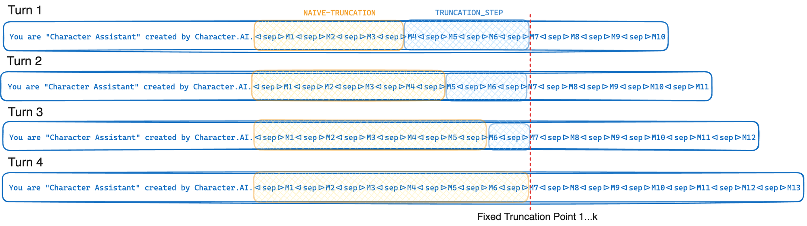

[](https://pepy.tech/project/prompt-poet)

# Prompt Poet

Prompt Poet streamlines and simplifies prompt design for both developers and non-technical users with its low code approach. Using a mix of YAML and Jinja2, Prompt Poet allows for flexible, dynamic prompt creation, enhancing the efficiency and quality of interactions with AI models. It saves time on engineering string manipulations, enabling everyone to focus more on crafting the optimal prompts for their users.

### Installation

```shell
pip install prompt-poet
```

### Basic Usage

```python
import os
import getpass

from prompt_poet import Prompt
from langchain import ChatOpenAI

# Uncomment if you need to set OPENAI_API_KEY.
# os.environ["OPENAI_API_KEY"] = getpass.getpass()

raw_template = """
- name: system instructions
  role: system
  content: |
    Your name is {{ character_name }} and you are meant to be helpful and never harmful to humans.

- name: user query
  role: user
  content: |
   {{ username}}: {{ user_query }}

- name: response
  role: user
  content: |
    {{ character_name }}:
"""

template_data = {
  "character_name": "Character Assistant",
  "username": "Jeff",
  "user_query": "Can you help me with my homework?"
}

prompt = Prompt(
    raw_template=raw_template,
    template_data=template_data
)

model = ChatOpenAI(model="gpt-4o-mini")
response = model.invoke(prompt.messages)
```

### Prompt Templates
Prompt Poet templates use a mix of YAML and Jinja2. Template processing occurs in two primary stages:

- Rendering: Initially, Jinja2 processes the input data. During this phase, control flow logic is executed, data is validated and appropriately bound to variables, and functions within the template are appropriately evaluated.
- Loading: Post-rendering, the output is a structured YAML file. This YAML structure consists of repeated blocks or parts, each encapsulated into a Python data structure. These parts are characterized by several attributes:
  - Name: A clear, human-readable identifier for the part.
  - Content: The actual string payload that forms part of the prompt.
  - Role (Optional): Specifies the role of the participant, aiding in distinguishing between different users or system components.
  - Truncation Priority (Optional): Determines the order of truncation when necessary, with parts having the same priority being truncated in the order in which they appear.

#### Example: Basic Q&A Bot
```yaml
- name: system instructions
  role: system
  content: |
    Your name is {{ character_name }} and you are meant to be helpful and never harmful to humans.

- name: user query
  role: user
  content: |
   {{ username}}: {{ user_query }}

- name: reply_prompt
  role: user
  content: |
    {{ character_name }}:
```

#### Interpolating Lists
If you have elements (e.g. messages) in a list you can parse them into your template like so.
```yaml

- name: chat_message
  role: user
  content: |
    {{ message.author }}: {{ message.content }}

```

#### Truncating Old Messages
Context length is limited and can’t always fit the entire chat history– so we can set a truncation priority on the message parts and Prompt Poet will truncate these parts in the order in which they appear (oldest to newest).
```yaml

- name: chat_message
  role: user
  truncation_priority: 1
  content: |
    {{ message.author }}: {{ message.content }}

```

#### Adapting to User Modality
To tailor instructions based on the user's current modality (audio or text).
```yaml

- name: special audio instruction
  role: system
  content: |
    {{ username }} is currently using audio. Keep your answers succinct.

```

#### Targeting Specific Queries
To include context-specific examples like homework help when needed.
```yaml


- name: homework_example_{{ loop.index }}
  role: user
  content: |
    {{ homework_example }}


```

#### Handling Whitespace
Prompt Poet will strip whitespace by default to avoid unwanted newlines in your final prompt. If you want to include an explicit space use the special built-in space marker “<|space|>” to ensure proper formatting.
```yaml
- name: system instructions
  role: system
  content: |
    Your name is {{ character_name }} and you are meant to be helpful and never harmful to humans.

- name: user query
  role: user
  content: |
   <|space|>{{ username}}: {{ user_query }}
```

#### Putting It All Together
Compositionality is a core strength of Prompt Poet templates, enabling the creation of complex, dynamic prompts.
```yaml
- name: system instructions
  role: system
  content: |
    Your name is {{ character_name }} and you are meant to be helpful and never harmful to humans.


- name: special audio instruction
  role: system
  content: |
    {{ username }} is currently using audio modality. Keep your answers succinct and to the point.




- name: homework_example_{{ loop.index }}
  role: user
  content: |
    {{ homework_example }}




- name: chat_message
  role: user
  truncation_priority: 1
  content: |
    {{ message.author }}: {{ message.content }}


- name: user query
  role: user
  content: |
   {{ username}}: {{ user_query }}

- name: reply_prompt
  role: user
  content: |
    {{ character_name }}:
```

#### Decomposing Into Sections
To maintain DRY principles in your templates, break them down into reusable sections that can be applied across different templates, such as when A/B testing a new prompt.
```yaml













```

### Design Choices

#### Prompt Poet Library
The Prompt Poet Library provides various features and settings, including prompt properties. Key features like tokenization and truncation help with efficient caching and low latency responses
```python
prompt.tokenize()
prompt.truncate(token_limit=TOKEN_LIMIT, truncation_step=TRUNCATION_STEP)

# Inspect prompt as a raw string.
prompt.string: str
>>> "..."

# Inpsect the prompt as raw tokens.
prompt.tokens: list[int]
>>> [...]

# Inspect the prompt as LLM API message dicts.
prompt.messages: list[dict]
>>> [...]

# Inspect the prompt as first class parts.
prompt.parts: list[PromptPart]
>>> [...]
```

#### Templating Language
Jinja2 and YAML combine to offer an incredibly extensible and expressive templating language. Jinja2 facilitates direct data bindings, arbitrary function calls, and basic control flow within templates. YAML provides structure to our templates (with depth=1) allowing us to perform sophisticated truncation when the token limit is reached. This pairing of Jinja2 and YAML is not unique – most notably it is used by [Ansible](https://github.com/ansible/ansible).

#### Template-native Function Calling
One standout feature of Jinja2 is the ability to invoke arbitrary Python functions directly within templates at runtime. This feature is crucial for on-the-fly data retrieval, manipulation, and validation, streamlining how prompts are constructed. Here `extract_user_query_topic` can perform arbitrary processing of the user's query used in the template's control flow--perhaps by performing a round-trip to a topic classifier.
```python


- name: homework_example_{{ loop.index }}
  role: user
  content: |
    {{ homework_example }}


```

#### Custom Encoding Function
By default Prompt Poet will use the TikToken “o200k_base” tokenizer although alternate encoding names may be provided in the top-level `tiktoken_encoding_name`. Alternatively, users can provide their own encode function with the top-level `encode_func: Callable[[str], list[int]]`.

```python
from tiktoken import get_encoding
encode_func = get_encoding("o200k_base")

prompt = Prompt(
    raw_template=raw_template,
    template_data=template_data,
    encode_func=encode_func
)
prompt.tokenize()
prompt.tokens
>>> [...]
```

#### Truncation
If your LLM provider supports GPU affinity and prefix cache, utilize Character.AI’s truncation algorithm to maximize the prefix-cache rate. The prefix cache rate is defined as the number of prompt tokens retrieved from cache over the total number of prompt tokens. Find the optimal values for truncation step and token limit for your use case. As the truncation step increases, the prefix cache rate also rises, but more tokens are truncated from the prompt.

```python
TOKEN_LIMIT = 128000
TRUNCATION_STEP = 4000

# Tokenize and truncate the prompt.
prompt.tokenize()
prompt.truncate(token_limit=TOKEN_LIMIT, truncation_step=TRUNCATION_STEP)

response = model.invoke(prompt.messages)
```

#### Cache-aware Truncation Explained
In short, Cache Aware Truncation truncates up to a fixed truncation point every time it is invoked–only moving this truncation point on average every k turns. This allows your LLM provider to maximally exploit GPU prefix cache described in [Optimizing Inference](https://research.character.ai/optimizing-inference/). If instead we simply truncated until reaching the token limit (L) this truncation point would move every turn which would cause a significant reduction in prefix cache rate. The tradeoff in this approach is that we often truncate more than we strictly need to.



#### Template Registry
A Template Registry is simply the concept of storing templates as files on disk. In using a Template Registry you can isolate template files from your python code and load these files directly from disk. In production systems, these template files can optionally be loaded from an in-memory cache on successive uses, saving on disk I/O. In the future a Template Registry may become a first-class citizen of Prompt Poet.

Filename: **chat_template.yml.j2**
```yaml
- name: system instructions
  role: system
  content: |
    Your name is {{ character_name }} and you are meant to be helpful and never harmful to humans.

- name: user query
  role: user
  content: |
   {{ username}}: {{ user_query }}

- name: response
  role: user
  content: |
    {{ character_name }}:
```

Run this python code from the same directory you have saved the file `chat_template.yml.j2` to.

```python
from prompt_poet import Prompt

prompt = Prompt(
    template_path="chat_template.yml.j2",
    template_data=template_data
)
print(prompt.string)
>>> 'Your name is Character Assistant and you are meant to be helpful and never harmful to humans.Jeff: Can you help me with my homework?Character Assistant:'
```

### Related Work
- [Priompt](https://github.com/anysphere/priompt): Priompt (priority + prompt) is a JSX-based prompting library. It uses priorities to decide what to include in the context window. This project achieves a similar goal in separating a templating layer from a logical construction layer written in and compatible with TypeScript-based usage.
- [dspy](https://github.com/stanfordnlp/dspy): Provides a great way of automagically optimizing prompts for different models though lacks deterministic control of the prompt important for things like caching and high-throughput, low latency production systems.
- [Prompt Engine](https://github.com/microsoft/prompt-engine): Born from a common problem of production prompt engineering requiring substantial code to manipulate and update strings this Typescript package similarly adds structure to the prompt templating process– though comes across as being somewhat opinionated making assumptions based on the use cases. With last commits being from 2 years ago it does not seem as though this package is in active development.
- [llm](https://github.com/simonw/llm): Allows basic prompts to be defined in YAML with the Jinja2 enabled features like dynamic control flow, function calling and data bindings.
- Raw Python f-strings: There are several projects that take slightly different approaches to prompt templating by wrapping f-strings:
  - [LangChain](https://python.langchain.com/v0.1/docs/modules/model_io/prompts/): LangChain has a much larger scope than prompt templates though it does provide some basic templating abstractions. Good for simple templating use cases then starts to get unwieldy as prompts increase in complexity.
  - [LlamaIndex](https://docs.llamaindex.ai/en/stable/module_guides/models/prompts/): Like LangChain, LlamaIndex has a much larger scope than prompt templates though it also provides some basic templating abstractions.
  - [Mirascope](https://github.com/Mirascope/mirascope): Implements a novel approach to prompt templating by encapsulating everything in a single python class and using the class’s docstring as the f-string into which to bind data.
